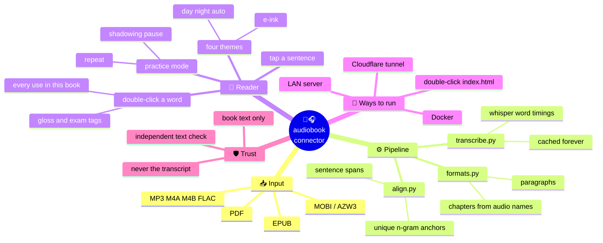
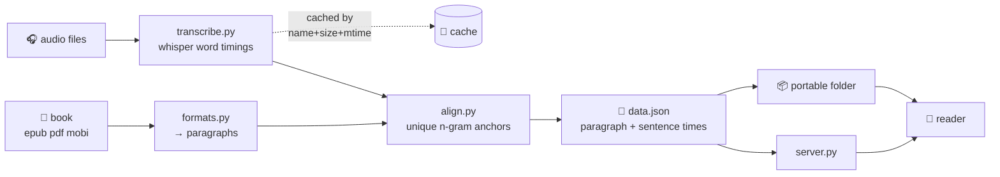
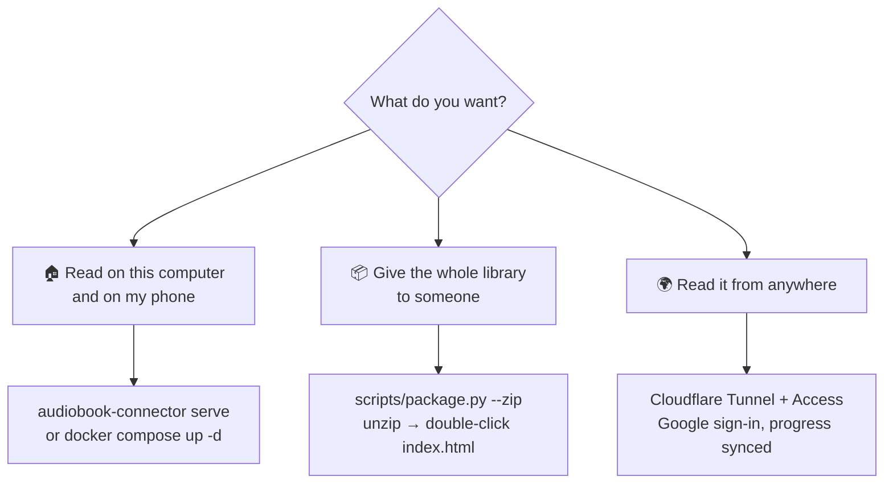
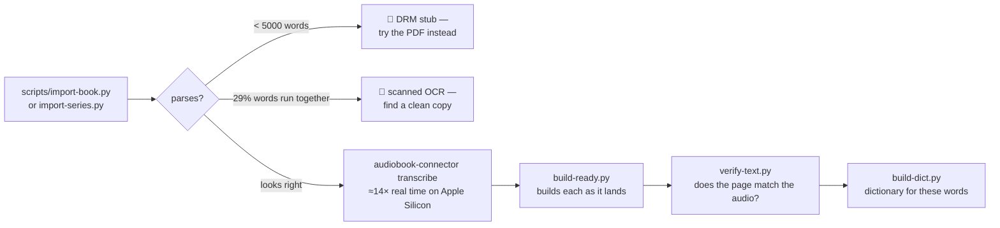

<h1 align="center">📖🎧 audiobook-connector</h1>

<p align="center">
  <b>Read a book while its audiobook plays. Tap any sentence to hear it.</b><br>
  <sub>Forced alignment with whisper · a reader built for language learners · runs on your own machine</sub>
</p>

<p align="center">
  
  
  
  
</p>

---

You own the ebook. You own the audiobook. They have nothing to do with each other — you read at
night, you listen while driving, and neither knows where the other left off.

This joins them. Point it at a folder with one book file and its audio, wait while whisper
transcribes, and you get a web page where **every sentence is clickable**: tap it and the narrator
reads that sentence, with the current one highlighted as it goes.

It runs on your machine, over your Wi-Fi. Your books never leave it.

```
books/hp1/                          library/hp1/                      📱 any device
├── 📕 hp1.pdf            ──►       ├── data.json  sentences+times  ──►   on your Wi-Fi
├── 🎧 Chapter 01.mp3               ├── 🖼 cover.jpg                      or a folder you
├── 🎧 Chapter 02.mp3  …            └── audio/ → ../../books/…            double-click
└── 🖼 cover.jpg
```

---

## 🗺️ The whole thing at a glance



## ⚙️ How it works



The anchors are the whole trick. An n-gram counts only if it appears **exactly once on both
sides** — once in the book, once in the transcript. Anything ambiguous is thrown away rather than
guessed, the survivors are trimmed to the longest run that stays in order, and a paragraph gets a
timestamp only if it *contains* one. No anchor, no timestamp, and the paragraph renders grey and
unclickable. **It fails closed.**

| step | module | what happens |
|---|---|---|
| 📕 parse | `formats.py` `epub.py` | EPUB read directly, no lxml; MOBI/AZW3 unpacked; PDF via `pypdf` layout mode with running-header and heading heuristics |
| 🎧 transcribe | `transcribe.py` | whisper with word timestamps — `mlx-whisper` on Apple Silicon, `faster-whisper` anywhere else; cached by name+size+mtime |
| 🎯 align | `align.py` | n-grams unique on both sides (n = 6→4→3→2), longest monotonic chain, then a time for every sentence |
| 🌐 serve | `server.py` | static HTTP with `Range` (needed for `<audio>` seeking), pre-compressed `.gz`, tiny JSON API |
| 📖 read | `app/` | two HTML files, no build step, no external requests |

## 🚀 Three ways to run it



### 🏠 On your own network

```bash
pip install -e '.[mlx]'                    # or '.[cpu]' off Apple Silicon
audiobook-connector build my-book
audiobook-connector serve                  # prints a http://192.168.x.x:8765 for your phone
```

Or without touching Python at all:

```bash
docker compose up -d
```

### 📦 As a folder or a zip — no install anywhere

```bash
scripts/package.py --zip                   # → dist/FlowGT-书房.zip
```

**Unzip, double-click `index.html`, read.** No server, no install, no network. `fetch()` is
blocked on `file://` by every browser, so the packager writes every data file twice — once as JSON
for the served mode, once as a `.js` that assigns a global — and the pages choose by protocol.
Audio symlinks are dereferenced so the zip works on Windows too. Reading position and vocabulary
still persist in that browser.

The same folder carries the server for when you want more: run `局域网模式` and phones on the same
Wi-Fi join in, with reading position shared between devices. That needs Python 3.10 and nothing
else — serving is pure standard library.

### 🌍 On the open internet, behind a login

A Cloudflare Tunnel plus an Access application gives you Google sign-in and per-account reading
position, with no port forwarded and no password of your own to store. See
[Public access](#-public-access-with-google-login) below.

## 📚 Adding a book



**Check the book parses before you spend hours transcribing.** A DRM-stripped EPUB can be a
392-word stub while the PDF beside it holds the whole text — that costs nothing to find out and it
has saved this project three hours more than once.

```bash
scripts/import-book.py "~/books/On Writing" --slug on-writing --title "On Writing" \
    --author "Stephen King" --exclude '*sample*' --prefer epub
audiobook-connector transcribe books/on-writing        # hours for a long book; resumable
scripts/build-ready.py books/on-writing
```

A book directory may carry a `book.json` — `title`, `author`, `series`, `volume`, `narrator`,
`language`, `chapters`. `series` and `volume` group a set on the shelf.

Chapter titles come from the **audio file names**: `Chapter 03 - The Knight Bus.mp3` is one
chapter, so the table of contents and the player can never disagree. They are matched fuzzily and
in order against the headings found in the book, all-or-nothing — under a 60 % match rate none are
used, because then they were never chapter titles.

## 🎓 Built for language learners

The unit that matters is the sentence, not the paragraph.

| 🎯 | what it does |
|---|---|
| **Sentence highlighting** | the sentence being read is picked out inside the paragraph being read |
| **Tap to hear** | click any sentence and the narrator starts there |
| **Repeat** | a sentence or a paragraph, 1–5 times or forever |
| **Shadowing pause** | stop after each sentence for 1–3 seconds, or for as long as the sentence took — hear it, pause, say it back |
| **Speed** | down to 0.5× |
| **Double-click a word** | pronunciation, Chinese and English glosses, which exam lists it is on, its frequency rank |
| **…and then this book** | every sentence in *this book* that uses the word, each one playable |
| **Vocabulary list** | exports as TSV for Anki, gloss and a real sentence included |

```
peculiar                    全书 4 处
/pi'kju:ljə/
a. 奇特的, 罕见的, 特殊的, 特别的
四级 六级 考研 托福 雅思  柯林斯★★  #5505
────────────────────────────────
THE BOY WHO LIVED
It was on the corner of the street that he
noticed the first sign of something peculiar
— a cat reading a map.                    ▶
```

The dictionary is built **for your library**, not shipped whole.
[ECDICT](https://github.com/skywind3000/ECDICT) (MIT) is 66 MB of CSV; `scripts/build-dict.py`
keeps only the words your books actually use — 29 000 across thirteen books — resolves inflections
back to their base form through ECDICT's own tables, and splits the result into one file per
letter. A lookup costs about 100 KB, fetched the first time you need it and never before.

```bash
mkdir -p cache/dict && curl -L -o cache/dict/ecdict.csv \
  https://raw.githubusercontent.com/skywind3000/ECDICT/master/ecdict.csv
scripts/build-dict.py
```

Long-press still reaches your device's own dictionary: the reader never hijacks text selection.

## 📖 The reader

| key / gesture | action |
|---|---|
| tap a sentence | 🔊 play from there |
| double-click a word | 📗 look it up |
| select text | ⭐ save the passage, look up, or play from it |
| `space` | ▶ play / pause |
| `←` `→` | ⏪ ⏩ 5 seconds |
| `j` `k` | next / previous sentence |
| `r` | 🔁 replay this sentence |
| `d` | 🎯 practice mode |
| `m` | ⭐ save this paragraph |
| `w` | 📗 look up the selection |
| `/` | 🔍 search the whole book |
| `t` | 📑 chapters |

**Four themes**: follow-system, day, night, and **e-ink** — pure black on white, every transition
and shadow removed, larger type, the current sentence underlined instead of shaded. The page loads
no webfont and no script from anywhere, so it opens on a Kindle experimental browser or a Boox
tablet exactly as it does on a laptop. Type size, line height, column width and paragraph indent
are adjustable and remembered.

A scrubber, ±5 s, sentence skip, speed and a **sleep timer** sit in the bottom bar; on a phone the
lock screen and headphone buttons drive it through the Media Session API. Reading position is
remembered per device, and per account when signed in.

**Performance.** Off-screen paragraphs are skipped with `content-visibility`, sentence spans are
wrapped only around the scroll position, and a word lookup scans on demand instead of indexing the
whole book. Order of the Phoenix — 8 915 paragraphs, 16 614 sentences — loads in about a third of
a second and settles around 17 MB with the dictionary open.

## 🛡️ Can you trust what is on the page?

**Yes, and here is the mechanism rather than a promise.** Every word you read comes from the book
file. whisper's output is a ruler used to find timings and is then discarded — a paragraph in
`data.json` carries the book's own text plus `{file, start, end}` and a list of sentence spans, and
nothing else. There is nowhere for transcript text to be stored, let alone shown.

`scripts/verify-text.py` checks it from the other direction, using the transcript as an independent
witness: for each aligned paragraph, how much of the book's word sequence actually appears in the
audio over that span?

| | across 13 books |
|---|---|
| paragraphs checked | 36 209 |
| median coverage | **1.000** |
| ≥ 0.90 | **93.9 %** |
| < 0.55 | 46 (0.13 %) |

Every one of those 46 turns out to be dialect (*"Yeh all righ', Harry?"*), a character speaking
with their mouth full, front matter the narrator skipped, or a number the book spells out and
whisper writes in digits. None is damaged book text.

> **Read alignment by words, not paragraphs.** A book's index is hundreds of two-word paragraphs
> nobody narrates, which is why Zero to One reads "50 % of paragraphs" while **94 % of its words**
> are aligned. Harry Potter runs at 100 %.

## 🧰 Commands

```
audiobook-connector build <dir|name> [--title T] [--author A] [--slug S] [--language en]
                                     [--model large-v3-turbo] [--backend auto|mlx|faster]
                                     [--audio symlink|hardlink|copy]
audiobook-connector transcribe <dir|name>...      # fill the cache only
audiobook-connector serve [--port 8765] [--host 0.0.0.0]
audiobook-connector list

scripts/import-book.py   <src>...     one title: a folder with a book and its audio
scripts/import-series.py <audio> <books>   a multi-volume set, paired in order
scripts/cache-status.py  <book-dir>...     how much is transcribed
scripts/build-ready.py   <book-dir>...     build every book whose audio is ready
scripts/verify-text.py   [<slug>...]       cross-check the text against the audio
scripts/build-dict.py                      dictionary for the words this library uses
scripts/package.py       [--zip]           a folder that runs by double-clicking index.html
scripts/backup.sh        [dest]            library + transcripts + dictionary, verified
```

Environment: `AC_BOOKS` `AC_LIBRARY` `AC_CACHE` `AC_PORT` `AC_HOST` `AC_BACKEND`, plus
`AC_ACCESS_TEAM` `AC_ACCESS_AUD` `AC_REQUIRE_AUTH` for Cloudflare Access, or `AC_PROXY_SECRET` for
a trusted proxy. Optional extras: `[cpu]` faster-whisper · `[mlx]` mlx-whisper · `[formats]` pypdf
+ mobi. **The core has no runtime dependencies at all.**

## ⚡ How long does it take?

Measured on an M-series Mac with `mlx-whisper` and `large-v3-turbo`: the seven Harry Potter
volumes, **124 hours of audio, transcribed in 9 hours** — about 14× real time. Building afterwards
is seconds per book, because transcripts are cached by name + size + mtime and never recomputed.

CPU (so, Docker) runs at roughly real time. For a long series, transcribe once on Apple Silicon and
copy the `cache/transcripts` folder — or the whole backup — to wherever you want to serve it.

## 🔐 Public access with Google login

Cloudflare Tunnel puts the reader on a hostname without forwarding a port; Cloudflare Access puts
Google sign-in in front of it and hands the app a signed JWT. `auth.py` verifies that token itself
— RS256 with `pow()`, standard library only — and turns it into an email, which is the key reading
position is stored under. Requests that look like they came through Cloudflare but carry no valid
token are refused rather than treated as anonymous: **it fails closed.**

There is a second mode for putting it behind a site you already run: a reverse proxy that proves
itself with a shared secret may assert the user in a header. When that secret is set, every request
without it is refused, LAN included.

## 💾 Backup

```bash
scripts/backup.sh /path/to/backups
```

The default set is what is expensive or irreplaceable: `cache/transcripts/` (hours of compute) and
`library/` — including `library/_progress/`, which holds reading positions and saved passages and
exists nowhere else. `books/` is left out because its files are usually hard links into a library
you already keep; `--with-books` includes them for an archive that stands alone. The script reads
the archive back and checks two expected members before reporting success, because an archive
nobody opened is not a backup.

## ⚠️ Limits

- 🇬🇧 Tested on English books. CJK tokenisation exists in `align.py` but is unverified.
- 📄 PDF input is heuristic. Scanned PDFs with damaged OCR are not usable — the reader shows the
  book's own text, so the damage would be what you read. Check before you transcribe.
- 🎙 Alignment needs the same edition on both sides. An abridged audiobook against an unabridged
  text aligns poorly; `build` warns below 20 % word coverage.
- 🔢 The aligner's number map covers 0–10, so a book that spells out "seven hundred and thirteen"
  where whisper writes "713" loses that anchor.
- 🔓 Without Cloudflare Access there is no authentication. LAN mode is for a network you trust.
- 🧪 No test suite yet. `align.align()` is a pure function and is the obvious place to start.

---

## 中文速览

把一本书（epub / pdf / mobi / azw3）和它的有声书音频放进 `books/<名字>/`，然后：

```bash
docker compose run --rm cli build <名字>     # 转写 + 对齐
docker compose up -d                         # 局域网里任何设备打开 http://<服务器IP>:8765
```

Apple 芯片的 Mac 转写快 14 倍：本机 `pip install -e '.[mlx,formats]'` 后 `build`，
再 `scripts/backup.sh` 打包，把 tgz 拷到服务器解开，`docker compose up -d` 即可，不会重新转写。

**阅读器是按英语学习设计的。** 正在朗读的**那一句**会在段落里高亮，点任意一句从那句开始播；
练习模式可以整句或整段复读 1–5 遍或一直重复，每句后可停 1–3 秒或与该句等长——听一句、停、
自己说一遍，就是跟读循环，语速可以降到 0.5 倍。**双击任意单词**能看到音标、中英释义、
考纲标签（中考/高考/四六级/考研/托福/雅思/GRE）、词频，以及它在**这本书**里的每一处原句，
点一句就跳过去听；生词本可导出成 TSV 喂给 Anki。词典按你的书库生成（源是 ECDICT，MIT），
按首字母分片，查一个词只加载约 100 KB。不劫持文本选择，长按依然能调系统词典。

四种主题：跟随系统 / 日间 / 夜间 / **墨水屏**。整页不加载任何外部字体和脚本，
所以 Kindle 实验浏览器和文石 Boox 上一样能开。

**章节名取自音频文件名**（`Chapter 03 - The Knight Bus.mp3`），按顺序模糊匹配到书里认出的标题上
——一个音频文件就是一章，目录和播放器因此永远一致。

**拷到另一台电脑**：`scripts/package.py --zip` 打出一个 zip，**解压后双击 index.html 就能读**
——不装东西、不起服务、不联网。想让手机也能看、并在设备间同步进度，
同一个文件夹里还有「局域网模式」启动脚本（只需要 Python 3.10）。

**你读到的每个字都来自书本身**，whisper 的输出只当尺子量时间点，量完就扔。
锚点必须是两边各只出现一次的 n-gram，段落包含锚点才给时间，否则显示为灰色不可点——
宁可不给，不给错的。`scripts/verify-text.py` 把转写反过来当独立证人核对：
十三本书 36209 段，中位吻合 1.000，93.9% ≥ 0.90。

## License

MIT
