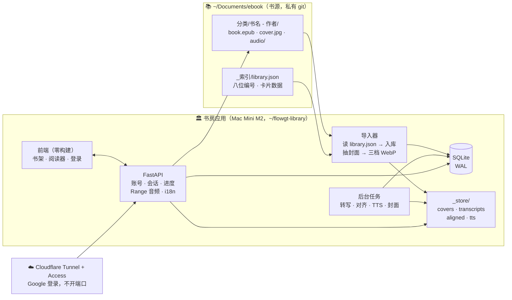

# 合并方案：ebook 书库 × audiobook-connector → 一个「书房」

> 状态：草案，等确认。2026-09-10。
> 目标：一台常开的 Mac Mini M2 上跑一个有账号、中英双语、海报书架的私人图书馆，
> 每本书标明有声 / 无声，无声的将来可以由 AI 朗读。

---

## 0. 一句话结论

**合并成一个产品，不合并成一个仓库。**

| | 现在 | 合并后 |
|---|---|---|
| `~/Documents/ebook` | 书库（数据，私有 git，只跟踪结构） | **仍是唯一的书源**。它的四条铁律、`build_index.py`、八位编号全部保留 |
| `audiobook-connector` | 对齐管线 + 阅读器（代码，公开 git） | 变成**书房应用**：数据库、账号、书架、阅读器、后台任务。指向 ebook 目录读书 |

为什么不塞进一个仓库：书库故意不把 6 GB 的书交给 git，而代码库是公开的。混在一起要么把书暴露出去，要么把代码藏起来。两个仓库、一个产品，各守各的规矩。

---

## 1. 第一阶段：先把书库根目录清干净

书库主页现在散落着 8 项，全部违反铁律 0（命名）或铁律 1（一书一夹）。查过索引，**这 8 项都不是库里已有的书**（无重复）。

| 现在的名字 | 实际是什么 | 建议动作 | 待你定的 |
|---|---|---|---|
| `YES/` 8 个 mp3 | **《谈判力》有声书**（ID3：Fisher/Ury/Patton，Murphy Guyer 朗读，约 8 小时） | 与下一项**合并** | — |
| `Getting to Yes - … [Qwerty80]/` pdf + Cover.jpg | 同一本书的正文 | → `04-职业与成长/谈判力 Getting to Yes - 罗杰·费希尔 Roger Fisher/`，音频进 `audio/`，`Cover.jpg`→`cover.jpg` | 归 04 还是 06 |
| `Nonviolent Communication - … (audiobook)/` 37 个 mp3 | **《非暴力沟通》有声书**，按 CD/章节切 | → `07-心理与人生/非暴力沟通 Nonviolent Communication - 马歇尔·卢森堡 Marshall Rosenberg/audio/` | 归 07 还是 02 |
| `Marshall Rosenberg PhD - 2015 - …/` 4 个 mp3 | **同一本书**的另一个有声版（4 大段） | 隔离到 `_索引/_重复文件待确认/`（铁律 3：不静默删） | 要不要留两版 |
| `A Helping Hand - … Liv Larsson …/` epub | 另一本书：NVC 调解 | → `07-心理与人生/A Helping Hand - Liv Larsson/`（无可靠中译名，留单语） | — |
| `Croll A. Lean Analytics … 2024/` **两个 pdf** | Croll 的《精益数据分析》+ 一本来路不明的 Wright "Complete Guide" | **拆开**：Croll → `06-商业与创业/精益数据分析 Lean Analytics - 阿利斯泰尔·克罗尔 Alistair Croll/`；Wright → `00-收件箱/` 等你看 | Wright 那本要不要 |
| `Interviewing Users/` `193382011XUsers.pdf` | Steve Portigal《用户访谈》 | → `06-商业与创业/Interviewing Users - Steve Portigal/`，中译名待确认 | 归 06 还是 09 |
| `Harry Potter Audio Books 1-7…/` 1.3 GB | 七册有声书 | 见下 | **是否把「全七册」拆成七个文件夹** |

**哈利波特要做一个决定。** 现在 `11-小说与故事/哈利·波特（全七册）…/` 是一个文件夹装七本 pdf。铁律 1 说一书一夹；应用里每一册是一本书、各有进度、各有海报。建议拆成七个：`哈利·波特1：魔法石 Harry Potter and the Philosopher's Stone - J.K.罗琳 J.K. Rowling/`，每个里面 pdf + `cover.jpg` + `audio/`。这会把 1 个索引条目变成 7 个。

**空缺**：《非暴力沟通》只有音频没有正文，没法对齐——需要一个 epub。

做完以上，跑 `python3 _索引/build_index.py` 收尾（铁律零）。

---

## 2. 第二阶段：有声 / 无声

不设手动标签。**「有声」是从数据推出来的**：一本书有 ≥1 个 `audio_edition` 就是有声。手动打标签会和磁盘对不上——书库自己的经验。

书库现在：

| | 本数 |
|---|---|
| 库内已带 `audio/` 的 | 13 |
| 根目录散落待归的有声 | 3（谈判力、非暴力沟通、哈利波特七册） |
| 无声 | 约 150 |

应用把音频分成两类，同一本书可以同时有：`human`（真人朗读，Stephen Fry）和 `tts`（AI 朗读）。**AI 朗读的那一版不需要 whisper**——TTS 引擎生成时就知道每句话的起止时间，对齐是免费的、精确到毫秒的。M2 上 mlx-audio / Kokoro 跑得比实时快，一本 8 小时的书大约一两个小时。

---

## 3. 第三阶段：架构

### 3.1 怎么存书

- **原件不动、不搬、不改名**。书文件留在 ebook 目录，由书库规则管。应用只在数据库里记「路径 + 内容哈希」。
- **书的身份 = 书库已有的八位编号**（`build_index.py` 从「书名+作者」算出来、全库唯一）。应用不另造 id，导入即对齐。
- **派生物全部进应用自己的 `_store/`**，按内容哈希命名，可整目录删掉重建：封面三档、转写缓存、对齐结果、TTS 音频。

### 3.2 怎么存图

每本书三档 WebP + 主色，导入时生成一次：

| 档 | 宽 | 用途 |
|---|---|---|
| s | 200 | 列表、续读条 |
| m | 400 | 书架卡片 |
| l | 900 | 详情页海报、Media Session 锁屏 |

海报来源按优先级，记在 `cover.source`：
1. 书文件内嵌封面（epub 声明的 / pdf 第一页）
2. `_索引/卡片数据.tsv` 里你已经手工选的「封面URL」（这份数据已经存在）
3. **生成式排版海报**：书名 + 作者 + 分类色，永远可用、整架风格统一
4. AI 生成（可选，逐本按需）

同一张图在数据库里只有一行、磁盘上只有一份；换封面 = 换 `cover` 行，不碰书。

### 3.3 数据库

SQLite（WAL 模式）。一台 Mac Mini、几个人用、单文件、`cp` 就是备份——PostgreSQL 在这个规模上只多出运维。真到了几十个并发用户再换。

几个设计要点：

- **`session` 统一了「设备」和「登录」**。现在的设备 cookie 就是一条 `user_id` 为空的 session；某天在手机上登录，那条 session 挂到账号下，之前在那台手机上读的进度自动归入账号。不丢。
- **`progress` 和 `mark` 属于账号或会话，不属于设备**——换手机登录，进度跟人走。
- **`transcript` 按音频哈希缓存**，和现在 `cache/transcripts` 的键一致，13 小时的算力原样迁入。
- **`job` 表是后台队列**。转写、TTS、封面都是分钟到小时级的活，Mac Mini 单机跑一个工作进程顺序消化，前端显示进度。
- 中英双语：书名、作者、分类、简介、标签都有 `_zh` / `_en` 两列，界面文案是一份 JSON 字典。书库文件夹名本来就是「中文 English」，导入时直接拆。

### 3.4 前后端

| 层 | 选择 | 理由 |
|---|---|---|
| 后端 | **FastAPI + uvicorn**，Python | 账号、会话、校验、文件流（Range）、OpenAPI 免费得到。现在 125 行的标准库服务器承载不了账号系统。对齐管线（`formats/transcribe/align`）**原样保留**，仍是纯函数 |
| 数据库 | SQLite，标准库 `sqlite3` | 见上 |
| 前端 | **仍是零构建的静态页**，一份 i18n JSON | 现在的阅读器在 Kindle / Boox 上能开，这是硬约束；书架页重做成登录 + 语言切换 + 海报网格 |
| 密码 | `hashlib.scrypt`，标准库 | 不自造加密；公网侧仍走 Cloudflare Access，账号系统管的是「谁在读」 |
| 部署 | Mac Mini M2，`~/flowgt-library`（**不在 `~/Documents`**），LaunchAgent + KeepAlive，Cloudflare Tunnel + Access | 位置的坑已经用实验确认过：launchd 读不了 `~/Documents` |

---

## 4. 顺序

| 步 | 做什么 | 产出 | 大约 |
|---|---|---|---|
| 1 | 清根目录（§1 那张表），跑 `build_index.py` | 干净的书库，8 位编号齐全 | 半天，含你拍板 |
| 2 | 新仓库骨架：SQLite schema、导入器（读 `library.json` → `book/category/cover`） | 数据库里有 170 本书、每本有封面 | 1 天 |
| 3 | 账号 + 会话（吸收现在的设备 cookie）+ 进度/收藏迁移 | 登录能用，老进度不丢 | 1 天 |
| 4 | 书架页：海报网格、有声/无声徽章、中英切换、搜索、续读 | 「精美展示界面」 | 1–2 天 |
| 5 | 接现有阅读器到新 API；13 本已对齐的书直接可用 | 听读功能回归 | 半天 |
| 6 | 后台任务队列 + 谈判力 / 非暴力沟通 / 哈利波特入库对齐 | 16 本有声 | 转写跑一晚 |
| 7 | TTS 试点：挑一本无声书用 Kokoro 生成，走同一条对齐/阅读链 | 第一本 AI 有声书 | 1 天 |
| 8 | Mac Mini 部署：`handoff` 迁移 → LaunchAgent → Tunnel + Access | 公网可读 | 半天 + 你刷卡激活 Zero Trust |

---

## 5. 云主机：有没有「租一台真电脑、100 GB 免费、按机器不按流量」

**有，而且只有一家真正免费到这个程度：Oracle Cloud Always Free。** 官网原文 `[A · docs.oracle.com FreeTier · 核实 2026-09-10]`：

| 资源 | 永久免费额度 |
|---|---|
| Arm（Ampere A1）虚拟机 | 每月 1500 OCPU·小时 + 9000 GB·小时 ≈ **2 OCPU + 12 GB 内存** 常开 |
| AMD 微型机 | 2 台（各 1/8 OCPU） |
| 块存储 | **200 GB**（启动盘 + 数据盘合计；最小启动盘 47 GB） |

这就是你描述的东西：一台 24 小时开着的机器，200 GB 盘，不按流量收费。

但要知道的三件事（这三条是常见反馈，**未在官网逐字核对** `[C]`）：Arm 机型经常「无可用容量」要反复试；注册要信用卡且不同地区通过率不一；长期闲置的 Always Free 实例可能被回收。

**付费但便宜且可预期**的是 Hetzner（德国）：最小机型每月几欧元、含 20 TB 流量、按小时计费封顶 `[D · 我的记忆，未核实，价格页是 JS 渲染没抓到]`。要走这条我先去核实。

**我的建议还是 Mac Mini M2。** 它比以上任何免费机器都强——尤其是 mlx 转写和 TTS，这两件事云上的免费 Arm 机根本跑不动。云主机的正确用法是**镜像或备援**，不是主力。另外一条不变的提醒：这批是商业有声书，放到别人的机器上前面必须挂 Access，不能公开可达。

---

## 6. 现在要你定的

1. §1 表里四个「归哪个分类」和「哈利波特拆不拆」。
2. 非暴力沟通留一版还是两版。
3. 同意「两个仓库、一个产品」，还是坚持合成一个 git 仓库。
4. 前端要不要上框架。我的建议是不要——零构建是 Kindle/Boox 能开的原因。

定了就从第 1 步开始。
