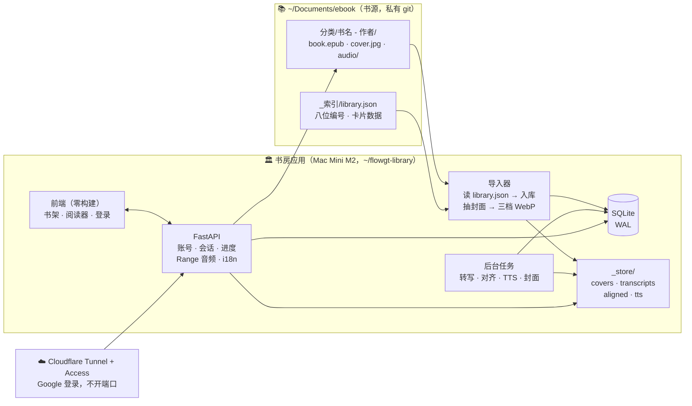
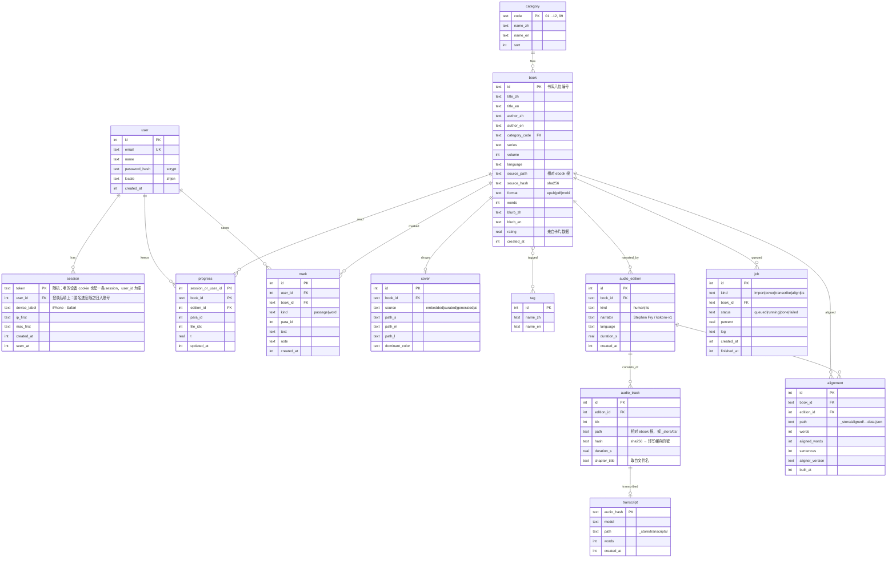
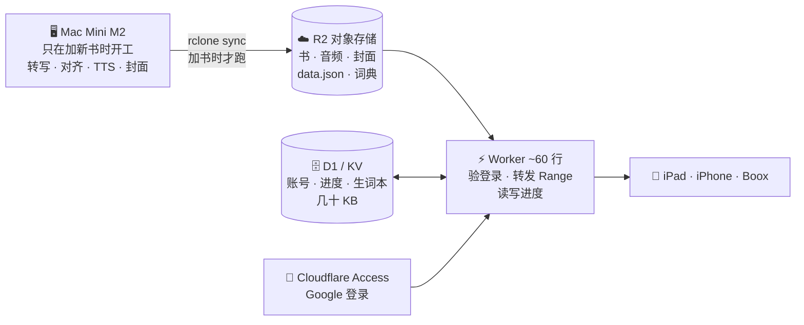

# 合并方案：ebook 书库 × audiobook-connector → 一个「书房」

> 状态：草案，等确认。2026-09-10。
> 目标：一个有账号、中英双语、海报书架的私人图书馆，每本书标明有声 / 无声，
> 无声的将来可以由 AI 朗读。**放送在对象存储上（§5），Mac Mini M2 只负责加新书。**

---

## 0. 一句话结论

**合并成一个仓库 `flowgt-ebook`**（2026-09-10 定）。

```
flowgt-ebook/                 一个仓库，私有
├── app/                      书房应用：FastAPI · 导入器 · 后台任务
│   └── web/                  前端（零构建）
├── pipeline/                 原 audiobook_connector：formats · transcribe · align
├── 01-思维与决策/ … 99-资料与说明书/    书本身，**git 忽略**
├── _索引/                    书库规则与索引脚本，**跟踪**
├── _store/                   派生物（封面 · 转写 · 对齐 · TTS），**git 忽略**
├── AGENTS.md  CLAUDE.md      两套规则合成一份
└── scripts/
```

书库原本就只跟踪结构不跟踪书（`.gitignore` 排除所有 epub/pdf/mp3），合并后沿用这条。

⚠️ **合并后仓库必须设为 private。** 它会同时含有 170 本书的整理元数据（路径、评分、
个人笔记、书单）和应用代码。现在的 `ebook` 是私有、`audiobook-connector` 是公开——
合并只能取更严的那一档。代价是对齐管线不再公开；真想开源，日后把 `pipeline/` 单独
发一个包即可，那部分是纯函数、没有个人数据。

---

## 1. 第一阶段：先把书库根目录清干净

书库主页现在散落着 8 项，全部违反铁律 0（命名）或铁律 1（一书一夹）。查过索引，**这 8 项都不是库里已有的书**（无重复）。

| 现在的名字 | 实际是什么 | 建议动作 | 待你定的 |
|---|---|---|---|
| `YES/` 8 个 mp3 | **《谈判力》有声书**（ID3：Fisher/Ury/Patton，Murphy Guyer 朗读，约 8 小时） | 与下一项**合并** | — |
| `Getting to Yes - … [Qwerty80]/` pdf + Cover.jpg | 同一本书的正文 | → `04-职业与成长/谈判力 Getting to Yes - 罗杰·费希尔 Roger Fisher/`，音频进 `audio/`，`Cover.jpg`→`cover.jpg` | 归 04 还是 06 |
| `Nonviolent Communication - … (audiobook)/` 37 个 mp3 | **《非暴力沟通》有声书**，按 CD/章节切 | → `07-心理与人生/非暴力沟通 Nonviolent Communication - 马歇尔·卢森堡 Marshall Rosenberg/audio/` | 归 07 还是 02 |
| `Marshall Rosenberg PhD - 2015 - …/` 4 个 mp3 | **同一本书**的另一个有声版（4 大段，64 kbps） | **建议弃用**，见 §1.1 | 你确认后隔离 |
| `A Helping Hand - … Liv Larsson …/` epub | 另一本书：NVC 调解 | → `07-心理与人生/A Helping Hand - Liv Larsson/`（无可靠中译名，留单语） | — |
| `Croll A. Lean Analytics … 2024/` **两个 pdf** | Croll 的《精益数据分析》+ 一本来路不明的 Wright "Complete Guide" | **拆开**：Croll → `06-商业与创业/精益数据分析 Lean Analytics - 阿利斯泰尔·克罗尔 Alistair Croll/`；Wright → `00-收件箱/` 等你看 | Wright 那本要不要 |
| `Interviewing Users/` `193382011XUsers.pdf` | Steve Portigal《用户访谈》 | → `06-商业与创业/Interviewing Users - Steve Portigal/`，中译名待确认 | 归 06 还是 09 |
| `Harry Potter Audio Books 1-7…/` 1.3 GB | 七册有声书 | 见下 | **是否把「全七册」拆成七个文件夹** |

> **已执行 2026-09-10**：已拆成七本独立的书，索引重建为 182 本。

**哈利波特要做一个决定。** 现在 `11-小说与故事/哈利·波特（全七册）…/` 是一个文件夹装七本 pdf。铁律 1 说一书一夹；应用里每一册是一本书、各有进度、各有海报。建议拆成七个：`哈利·波特1：魔法石 Harry Potter and the Philosopher's Stone - J.K.罗琳 J.K. Rowling/`，每个里面 pdf + `cover.jpg` + `audio/`。这会把 1 个索引条目变成 7 个。

### 1.1 非暴力沟通：两版都完整，但 A 版明显更适合这个产品

> **已执行 2026-09-10**：B 版已移入废纸篓，留 A 版。

| | A 版 `… (audiobook)` | B 版 `Marshall Rosenberg PhD - 2015` |
|---|---|---|
| 时长 | 5.11 小时 | 5.16 小时 |
| 文件 | **36 个，按章切**（4 张 CD） | 4 个，每个 ~78 分钟 |
| 章节名 | **36 个真实章节名**（`The Origins of Nonviolent Communication`、`Receiving Gratitude`…） | 只有 `01 02 03 04` |
| 码率 | **129 kbps** | 64 kbps |
| 体积 | 287 MB | 143 MB |

**两版内容都完整**，时长只差 3 分钟（约 1%），是片头片尾的差别，不是缺内容。

**建议留 A 版。** 决定性的一条是章节名：本产品的目录直接取自音频文件名，A 版能给出
36 章的完整目录，B 版的目录会是空的。码率也高一倍。B 版唯一的优势是省 144 MB——
在 10 GB 的免费额度面前不值得。

**空缺**：这本书目前**只有音频没有正文**，没法做逐句对齐。需要补一个 epub 或 pdf，
补上之前它只能当纯有声书听。

做完以上，跑 `python3 _索引/build_index.py` 收尾（铁律零）。

---

## 2. 第二阶段：有声 / 无声

不设手动标签。**「有声」是从数据推出来的**：一本书有 ≥1 个 `audio_edition` 就是有声。手动打标签会和磁盘对不上——书库自己的经验。

书库现在：

| | 本数 |
|---|---|
| 库内已带 `audio/` 的 | 13 |
| 根目录散落待归的有声 | 3（谈判力、非暴力沟通、哈利波特七册） |
| 无声 | 约 150 |

应用把音频分成两类，同一本书可以同时有：`human`（真人朗读，Stephen Fry）和 `tts`（AI 朗读）。**AI 朗读的那一版不需要 whisper**——TTS 引擎生成时就知道每句话的起止时间，对齐是免费的、精确到毫秒的。M2 上 mlx-audio / Kokoro 跑得比实时快，一本 8 小时的书大约一两个小时。

---

## 3. 第三阶段：架构



### 3.1 怎么存书

- **原件不动、不搬、不改名**。书文件留在 ebook 目录，由书库规则管。应用只在数据库里记「路径 + 内容哈希」。
- **书的身份 = 书库已有的八位编号**（`build_index.py` 从「书名+作者」算出来、全库唯一）。应用不另造 id，导入即对齐。
- **派生物全部进应用自己的 `_store/`**，按内容哈希命名，可整目录删掉重建：封面三档、转写缓存、对齐结果、TTS 音频。

### 3.2 怎么存图

每本书三档 WebP + 主色，导入时生成一次：

| 档 | 宽 | 用途 |
|---|---|---|
| s | 200 | 列表、续读条 |
| m | 400 | 书架卡片 |
| l | 900 | 详情页海报、Media Session 锁屏 |

海报来源按优先级，记在 `cover.source`：
1. 书文件内嵌封面（epub 声明的 / pdf 第一页）
2. `_索引/卡片数据.tsv` 里你已经手工选的「封面URL」（这份数据已经存在）
3. **生成式排版海报**：书名 + 作者 + 分类色，永远可用、整架风格统一
4. AI 生成（可选，逐本按需）

同一张图在数据库里只有一行、磁盘上只有一份；换封面 = 换 `cover` 行，不碰书。

### 3.3 数据库

SQLite（WAL 模式）。一台 Mac Mini、几个人用、单文件、`cp` 就是备份——PostgreSQL 在这个规模上只多出运维。真到了几十个并发用户再换。



几个设计要点：

- **`session` 统一了「设备」和「登录」**。现在的设备 cookie 就是一条 `user_id` 为空的 session；某天在手机上登录，那条 session 挂到账号下，之前在那台手机上读的进度自动归入账号。不丢。
- **`progress` 和 `mark` 属于账号或会话，不属于设备**——换手机登录，进度跟人走。
- **`transcript` 按音频哈希缓存**，和现在 `cache/transcripts` 的键一致，13 小时的算力原样迁入。
- **`job` 表是后台队列**。转写、TTS、封面都是分钟到小时级的活，Mac Mini 单机跑一个工作进程顺序消化，前端显示进度。
- 中英双语：书名、作者、分类、简介、标签都有 `_zh` / `_en` 两列，界面文案是一份 JSON 字典。书库文件夹名本来就是「中文 English」，导入时直接拆。

### 3.4 前后端

| 层 | 选择 | 理由 |
|---|---|---|
| 后端 | **FastAPI + uvicorn**，Python | 账号、会话、校验、文件流（Range）、OpenAPI 免费得到。现在 125 行的标准库服务器承载不了账号系统。对齐管线（`formats/transcribe/align`）**原样保留**，仍是纯函数 |
| 数据库 | SQLite，标准库 `sqlite3` | 见上 |
| 前端 | **重新设计**，见 `docs/figma-brief.md`；实现仍走零构建静态页 + 一份 i18n JSON | 视觉重做，但「不下载网络字体、墨水屏零动画」这条硬约束不变——它是 Kindle / Boox 能打开的原因 |
| 密码 | `hashlib.scrypt`，标准库 | 不自造加密；公网侧仍走 Cloudflare Access，账号系统管的是「谁在读」 |
| 部署 | 见 §5：放送在 R2 + Worker，Mac Mini 只当「工厂」。若先在本机跑一版，放 `~/flowgt-library`（**不在 `~/Documents`**）+ LaunchAgent + Tunnel | 位置的坑已用实验确认：launchd 读不了 `~/Documents` |

---

## 4. 顺序

| 步 | 做什么 | 产出 | 大约 |
|---|---|---|---|
| 1 | 清根目录（§1 那张表），跑 `build_index.py` | 干净的书库，8 位编号齐全 | 半天，含你拍板 |
| 2 | 新仓库骨架：SQLite schema、导入器（读 `library.json` → `book/category/cover`） | 数据库里有 170 本书、每本有封面 | 1 天 |
| 3 | 账号 + 会话（吸收现在的设备 cookie）+ 进度/收藏迁移 | 登录能用，老进度不丢 | 1 天 |
| 4 | 书架页：海报网格、有声/无声徽章、中英切换、搜索、续读 | 「精美展示界面」 | 1–2 天 |
| 5 | 接现有阅读器到新 API；13 本已对齐的书直接可用 | 听读功能回归 | 半天 |
| 6 | 后台任务队列 + 谈判力 / 非暴力沟通 / 哈利波特入库对齐 | 16 本有声 | 转写跑一晚 |
| 7 | TTS 试点：挑一本无声书用 Kokoro 生成，走同一条对齐/阅读链 | 第一本 AI 有声书 | 1 天 |
| 8 | Mac Mini 部署：`handoff` 迁移 → LaunchAgent → Tunnel + Access | 公网可读 | 半天 + 你刷卡激活 Zero Trust |

---

## 5. 放哪里：对象存储才是这件事的正确形状

先把一个观察写下来，它决定了整节的结论：**阅读器要的东西，对象存储天生就会做。**

现在的阅读器向服务端要四种东西——`index.json`、`<书>/data.json`、词典分片、以及音频的
Range 请求。**四种全是「按字节读一个不变的文件」**，没有一次需要服务端算什么。真正需要 CPU
的转写、对齐、TTS，是「加新书」时的一次性工作，跟「读书」完全分离。

所以正确的切法不是「租一台电脑」，而是：



Mac Mini 从「门店」退回「工厂」：**它关机不影响任何人读书**，只影响加新书。

### 5.1 这个库到底要存多少

| | 文件数 | 体积 |
|---|---|---|
| 音频 mp3 | 620 | **5.04 GB** |
| pdf | 131 | 0.97 GB |
| epub | 104 | 0.37 GB |
| mobi | 52 | 0.16 GB |
| 封面等图片 | 180 | 0.24 GB |
| 派生物（data.json、词典、三档封面） | — | 约 0.1 GB |
| **合计** | 约 1600 | **约 9.1 GB** |

### 5.2 价格（官网原文，`核实 2026-09-10`）

| | 免费额度 | 超出后 |
|---|---|---|
| **R2 存储** | 10 GB-month/月 | $0.015 / GB-month |
| **R2 出站流量** | **Free** | **Free**（原文：Egress · Free） |
| R2 Class A（写） | 100 万次/月 | $4.50 / 百万 |
| R2 Class B（读） | 1000 万次/月 | $0.36 / 百万 |
| Workers | 10 万请求/天 | — |
| D1 | 每库 500 MB，账号 5 GB | — |

`[A · developers.cloudflare.com/r2/pricing · 2026-09-10]`
`[A · developers.cloudflare.com/workers/platform/limits · 2026-09-10]`
`[A · developers.cloudflare.com/d1/platform/limits · 2026-09-10]`

**9.1 GB 落在 10 GB 免费额度里，所以今天是 $0。** 库涨到 20 GB 也只有
`10 GB × $0.015 = $0.15/月`。

**出站免费是这里唯一真正重要的一条。** 听有声书是持续拉流——一本 8 小时的书按 24 kbps
约 90 MB。在按流量收费的地方（S3、Supabase）这是主要成本；在 R2 上它是零。

Backblaze B2 每 GB 更便宜（$0.006 vs $0.015，前 10 GB 也免费），但它的免费出站是
「月均存储量的 3 倍」——10 GB 存储对应 30 GB/月，约 300 次整本收听。够用，但要盯着。
在 10 GB 这个量级上 R2 的免费额度让差价归零，简单性胜出。

### 5.3 「网盘」和「对象存储」不是一回事

百度网盘 / Dropbox / OneDrive 适合**备份**，不适合**放送**：没有稳定的直链、Range 支持
不可靠、有速率限制、而且用它们当网站后端普遍违反服务条款。要「像网盘一样」但能被浏览器
直接流式读取的，是**对象存储**（R2 / B2 / S3）——一样是「一个云上的盘」，但每个文件有
稳定 URL、原生支持断点续传和 Range。R2 的 `R2GetOptions` 明确支持 ranged reads
`[A · developers.cloudflare.com/r2/api/workers · 2026-09-10]`，这是音频拖动进度条的前提。

Hetzner Storage Box 是真正的「网盘」（SFTP / WebDAV / Samba / rsync，按 TB 很便宜），
适合当**异地备份**的落点，不适合直接对浏览器放送。它的价格页是 JS 渲染的，我没抓到数字，
需要时再核 `[D · 未核实]`。

### 5.4 还需要虚拟机吗

不需要，但要知道代价：

| | R2 + Worker | Oracle Always Free 虚拟机 | Mac Mini M2 |
|---|---|---|---|
| 月成本 | $0（约 $0.15 起） | $0 | 电费 |
| 常开 | 是（无机器可关） | 是，但 Arm 机常抢不到容量 | 你说了算 |
| 跑 whisper / TTS | ✗ | ✗（太慢） | ✓ **快 14 倍实时** |
| 加新书 | 在 Mac 上做完再同步 | 同左 | 原地 |
| 运维 | 无 | 一台真服务器 | 一台自家机器 |

**结论：R2 + Worker 放送，Mac Mini 当工厂。** 虚拟机在这个组合里没有位置——它既不比
对象存储便宜，也跑不动真正需要算力的那部分。

### 5.5 要改多少代码

不多，因为阅读器本来就是静态的：

| 现在 | 改成 |
|---|---|
| `server.py` 静态 + Range | Worker 读 R2，`R2GetOptions.range` 直接给 206 |
| `/api/me` `/api/progress` `/api/marks` | 同一个 Worker，存 D1 |
| 设备 cookie 身份 | 原样保留，并入 §3.3 的 `session` 表 |
| 阅读器前端 | **不动**（它已经能跑在 `file://` 上，最不挑环境的一档） |
| 加新书 | `build` 之后多一步 `rclone sync ./library r2:library` |

Worker 大约 150 行。风险点是 Access 的登录 cookie 与 `<audio>` 的 Range 请求配合，
标准做法可行但**必须实测**，我不会不测就写进结论。

### 5.6 一条不变的提醒

这批是商业有声书。放到自家 Mac 上流给自己是一回事，上传到别人的基础设施是另一回事——
**无论 R2 还是任何云，前面都必须挂 Access，不能公开可达**。这也是 §3 里账号系统的意义。

## 6. 现在要你定的

已定：**一个仓库 `flowgt-ebook`**；前端**重新设计**（`docs/figma-brief.md`）。

还缺你拍板：

1. §1 表里四个「归哪个分类」：谈判力（04 还是 06）、非暴力沟通（07 还是 02）、
   用户访谈（06 还是 09）、Wright 那本 Lean Analytics 要不要。
2. **哈利波特拆不拆**成七个文件夹（建议拆，理由见 §1）。
3. 非暴力沟通 **B 版确认弃用**？（分析见 §1.1，建议留 A 版）
4. 合并后的 `flowgt-ebook` **设为 private** 确认（理由见 §0）。

定了就从第 1 步开始。
